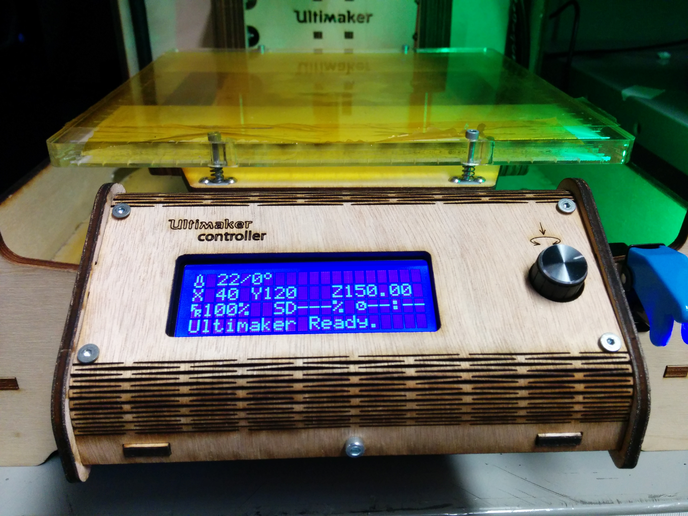
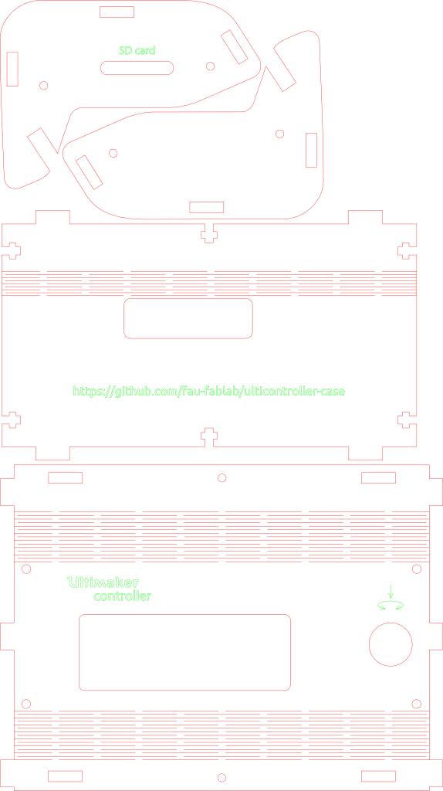

ulticontroller-case
===================

A wodden lasercut case for the Ulticontroller

Build Instructions
------------------

    green:	vector engraving
    black:	raster engraving
    red:	cut

Be carefull with the bending positions!

BOM:
----

- 4mm HDF or something similar
- 6x  M3 x 10 screws
- 4x  M3 x 20 screws
- 10x M3 screw nuts
- 4x  M3 x 14 spacer  

Visicut color-mapping
---------------------

If you use Visicut (https://github.com/t-oster/VisiCut) you can find a color-mapping under 

License
-------

 ulticontroller-case by <a xmlns:cc="http://creativecommons.org/ns#" href="https://github.com/fau-fablab/ulticontroller-case" property="cc:attributionName" rel="cc:attributionURL">https://github.com/fau-fablab/ulticontroller-case</a> is licensed under a <a rel="license" href="http://creativecommons.org/licenses/by-sa/4.0/">Creative Commons Attribution-ShareAlike 4.0 International License</a>.

Based on the original [ultimaker ulticontroller lasercutdrawing](https://github.com/Ultimaker/UltimakerOriginal/tree/master/1080_ulticontroller_lasercutdrawing)
