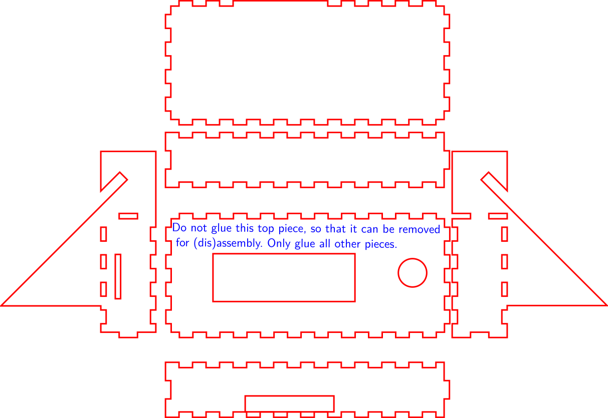

ulticontroller-case
===================

A wodden lasercut case for the Ulticontroller

TODO: image

Build Instructions
------------------

    red:	cut
    (blue:  notes and reference lines)

BOM:
----

- 4mm HDF or something similar
-  M3 x ??? screws
- M3 screw nuts

Visicut color-mapping
---------------------

cut all red lines, ignore the rest.

License
-------

 ulticontroller-case by <a xmlns:cc="http://creativecommons.org/ns#" href="https://github.com/fau-fablab/ulticontroller-case" property="cc:attributionName" rel="cc:attributionURL">https://github.com/fau-fablab/ulticontroller-case</a> is licensed under a <a rel="license" href="http://creativecommons.org/licenses/by-sa/4.0/">Creative Commons Attribution-ShareAlike 4.0 International License</a>.

Earlier versions were based on the original [ultimaker ulticontroller lasercutdrawing](https://github.com/Ultimaker/UltimakerOriginal/tree/master/1080_ulticontroller_lasercutdrawing)
